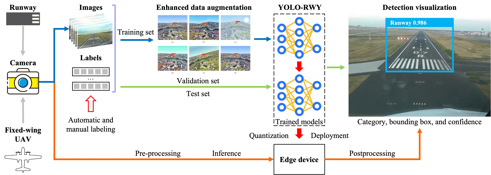

# LARD-Detection

This is the project code of the paper [YOLO-RWY: A Novel Runway Detection Model for Vision-Based Autonomous Landing of Fixed-Wing Unmanned Aerial Vehicles](https://www.mdpi.com/2504-446X/8/10/571) published in ***Drones***.

> The comments in the projects are mostly still in **Chinese**, we will modify them soon.



## Installation

First clone the project and create the conda environmrnt.

```shell
# Download project
https://github.com/flywithliye/lard-detection.git
cd lard-detection

# Create conda env
conda create -n lard python=3.9.7
pip install -r requirements.txt
```

Then install all the thirdparty projects in editable mode.

> Before installing the mmdet and mmyolo, you should navigate to their github repositories for instructions on their dependencies.
>
> The proposed YOLO-RWY **do not rely on** any codes from mmdet and mmyolo. So if you only need the YOLO-RWY, you can skip the mm parts.

```shell
# Install the modified thirdparty projects
cd 3rdparty/ultralytics  # ultralytics for the proposed YOLO-RWY
pip install -v -e .
cd ./../../
cd 3rdparty/mmdetection  # mmdetection for the baselines
pip install -v -e .
cd ./../../
cd 3rdparty/mmyolo  # mmyolo for the baselines
pip install -v -e .
cd ./../../
```

Set the environment variables according to your specifications. These variables are frequently used in the projects.

```shell
# modify the .bashrc or .zshrc file to add the following two variables.
export LARD_DATA_ROOT_PATH='/fileonssd/runway-dataset/lard-dataset'  # indicating the path to data
export LARD_PROJECT_ROOT_PATH='/home/yeli/workspace/lard/lard-detection'  # indicating the path to the main project
```

## Project outline

* `3rdparty/`: holds the modified thirdparty projects and codes.
  * `3rdparty/mmdetection`: mmdet codes with modifications for LARD det.
  * `3rdparty/mmyolo`: mmyolo codes with modifications for LARD det.
  * `3rdparty/ultralytics`: ultralytics codes with modifications for LARD det.
  * `3rdparty/Merge_COCO_FILES`: functions for merging coco json files.
* `cfg/`: holds config files for mmdet, mmyolo, and ultralytics.
  * `cfg/mmdet`: holds the model configs for **mmdetection** models.
  * `cfg/mmyolo`: holds the model configs for **mmyolo** models.
  * `cfg/ultralytics/`: holds the **main train and test scripts** of the YOLO-RWY.
    * `cfg/ultralytics/datasets/`: holds the dataset YAML files and the JSON files of the proposed EDA enhancement module.
    * `cfg/ultralytics/models/`: holds the model structure YAML files.
    * `cfg/ultralytics/weights/`: holds the pretrained weights of original YOLOv8.
* `datasets/`: holds the links to the datasets. You should prepare this folder according to [Dataset prepare](#dataset-prepare) section.
* `docs/`: holds the documentations.
* `logs/`: holds the logs of training and test.
* `papers/`: holds the notebook for results analysis and visulizations in the paper.
* `results/`: holds all kinds of the output results.
* `runs/`: holds the experimental details during training and test for mmdet, mmyolo, and ultralytics.
* `scripts/`: holds the scrpts for training, test, and evaluation of mmdet and mmyolo models.
* `src/`: holds the codes for dataset prepare, data analysis, and tools functions.
* `weights/`: just a link to the `cfg/ultralytics/weights`.

## Dataset prepare

The structure of the `datasets` folder should look like:

```shell
.
├── airports.csv
├── lard
│   ├── annotations -> /fileonssd/runway-dataset/lard-dataset/annotations
│   └── detection -> /fileonssd/runway-dataset/lard-dataset/YoloFormat/detection
├── LARD_train.csv
└── move.sh
```

You can prepare LARD datasets using code from `src/data`, please refer to the [Prepare Lard](docs/Prepare_Lard.md).

## Before start

1. we use `push plus` for notification with `Wechat`, you should comment out all the python code including `send_info`, and all the shell code including `send_info`.
2. Make sure to change the absolute path for dataset `yaml` files in `cfg/ultralytics/datasets`.
3. Make sure to update all the soft links using `ln -s` command.

## Train

### Train YOLO-RWY

The training/finetuning codes for YOLO-RWY is `cfg/ultralytics/train.py`. All the command lines for different configurations are in `exp_yolov8_train.sh`.

For directly reproducing the training of YOLO-RWY (640 image size by default), run:

```bash
# simple training
python cfg/ultralytics/train.py \
	--mode=merge \
	--cfg=lska_bifpn \
	--iou_type=EIoU \
	--aug_json=all \
	--album=0.05

# run in background and save log
python -u cfg/ultralytics/train.py \
	--mode=merge \
	--cfg=lska_bifpn \
	--iou_type=EIoU \
	--aug_json=all \
	--album=0.05 > logs/train/ultra_train_yolov8n_merge_att_fpn_iou_aug_lska_bifpn_eiou_aug_all_05_640.log 2>&1

```

> Note that, you should change `num_gpu` in `cfg/ultralytics/train.py`, in which we set to 10 by default.

For directly reproducing the finetuning of YOLO-RWY (640 image size by default), run:

```bash
# simple training
python cfg/ultralytics/train.py \
        --mode=finetune \
        --finetune_mode=single \
        --weights=runs/ultralytics/merge/yolov8n_lska_bifpn_EIoU_aug_all_5_640/train/weights/best.pt \
        --cfg=lska_bifpn \
        --iou_type=EIoU \
        --aug_json=all \
        --album=0.05

# run in background and save log
python -u cfg/ultralytics/train.py \
        --mode=finetune \
        --finetune_mode=single \
        --weights=runs/ultralytics/merge/yolov8n_lska_bifpn_EIoU_aug_all_5_640/train/weights/best.pt \
        --cfg=lska_bifpn \
        --iou_type=EIoU \
        --aug_json=all \
        --album=0.05 > logs/train/ultra_train_yolov8n_finetune_single_lska_bifpn_eiou_aug_all_05_640.log 2>&1
```

For other configurations, please check `exp_yolov8_train.sh` and `cfg/ultralytics/train.py`.

### Train mmdet models

You can run the following command line for the training of mmdet models.

```bash
# train faster_rcnn in mmdet using 10 gpus and with input size of 1333
./scripts/mmdet_train.sh faster_rcnn 10 1333

# other mmdet models
./scripts/mmdet_train.sh ssd 10 512
./scripts/mmdet_train.sh yolov3 10 608
./scripts/mmdet_train.sh retinanet 10 1333
./scripts/mmdet_train.sh centernet 10 1280
```

### Train mmyolo models

You can run the following command line for the training of mmyolo models.

```bash
# train yolov5 in mmyolo using 10 gpus and with input size of 640
./scripts/mmyolo_train.sh yolov5n 10 640

# other mmyolo models
./scripts/mmyolo_train.sh yolov6n 10 640
./scripts/mmyolo_train.sh yolov7t 10 640
./scripts/mmyolo_train.sh yolov8n 10 640
```

## Test

### Test YOLO-RWY

The test codes for YOLO-RWY is `cfg/ultralytics/test.py`. All the command lines for different configurations are in `exp_yolov8_test.sh`.

> Note: The following test code will try to locate the corresponding trained weights with the same training configs, so you have to train first.

For directly reproducing the test of YOLO-RWY, run:

```bash
# simple test
python cfg/ultralytics/test.py \
	--mode=merge \
	--merge_mode=att_fpn_iou_aug \
	--cfg=lska_bifpn \
	--iou_type=EIoU \
	--aug_json=all \
	--album=0.05

# simple test using image size of 1280
python cfg/ultralytics/test.py \
	--mode=merge \
	--merge_mode=att_fpn_iou_aug \
	--cfg=lska_bifpn \
	--iou_type=EIoU \
	--aug_json=all \
	--album=0.05 \
	--test_size=1280

# run in background
python -u cfg/ultralytics/test.py \
	--mode=merge \
	--merge_mode=att_fpn_iou_aug \
	--cfg=lska_bifpn \
	--iou_type=EIoU \
	--aug_json=all \
	--album=0.05 > logs/test/ultra_test_yolov8n_merge_att_fpn_iou_aug_lska_bifpn_eiou_aug_all_05_640_640.log 2>&1

python -u cfg/ultralytics/test.py \
	--mode=merge \
	--merge_mode=att_fpn_iou_aug \
	--cfg=lska_bifpn \
	--iou_type=EIoU \
	--aug_json=all \
	--album=0.05 \
	--test_size=1280 > logs/test/ultra_test_yolov8n_merge_att_fpn_iou_aug_lska_bifpn_eiou_aug_all_05_640_1280.log 2>&1
```

for testing the finetuned YOLO-RWY, run:

```bash
# test the YOLO-RWY finetuned using `triple_split` strategy and 5% EDA prob.
python -u cfg/ultralytics/test_finetune.py \
        --mode=finetune \
        --finetune_mode=triple_split \
        --cfg=lska_bifpn \
        --iou_type=EIoU \
        --aug_json=all \
        --album=0.05 > logs/test/ultra_test_yolov8n_finetune_triple_split_lska_bifpn_eiou_aug_all_05_640.log 2>&1
```

For other configurations, please check `exp_yolov8_test.sh` and `cfg/ultralytics/test.py`.

### Test mmdet models

Please check the corresponding notebook files in the root path of this project.

### Test mmyolo models

Please check the corresponding notebook files in the root path of this project.

# Pretrained weights of YOLO-RWY

Coming soon. Will be uploaded to Release.

## Deployment

The deployment are performed under NVIDIA Jetson Orin.

Coming soon.

## Citations

If this project helps in your research, you are welcome to cite the paper.

```bibtex
@Article{drones8100571,
AUTHOR = {Li, Ye and Xia, Yu and Zheng, Guangji and Guo, Xiaoyang and Li, Qingfeng},
TITLE = {YOLO-RWY: A Novel Runway Detection Model for Vision-Based Autonomous Landing of Fixed-Wing Unmanned Aerial Vehicles},
JOURNAL = {Drones},
VOLUME = {8},
YEAR = {2024},
NUMBER = {10},
ARTICLE-NUMBER = {571},
URL = {https://www.mdpi.com/2504-446X/8/10/571},
ISSN = {2504-446X},
DOI = {10.3390/drones8100571}
}
```
